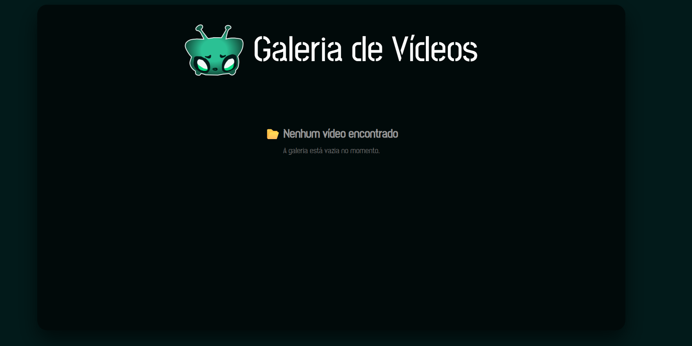
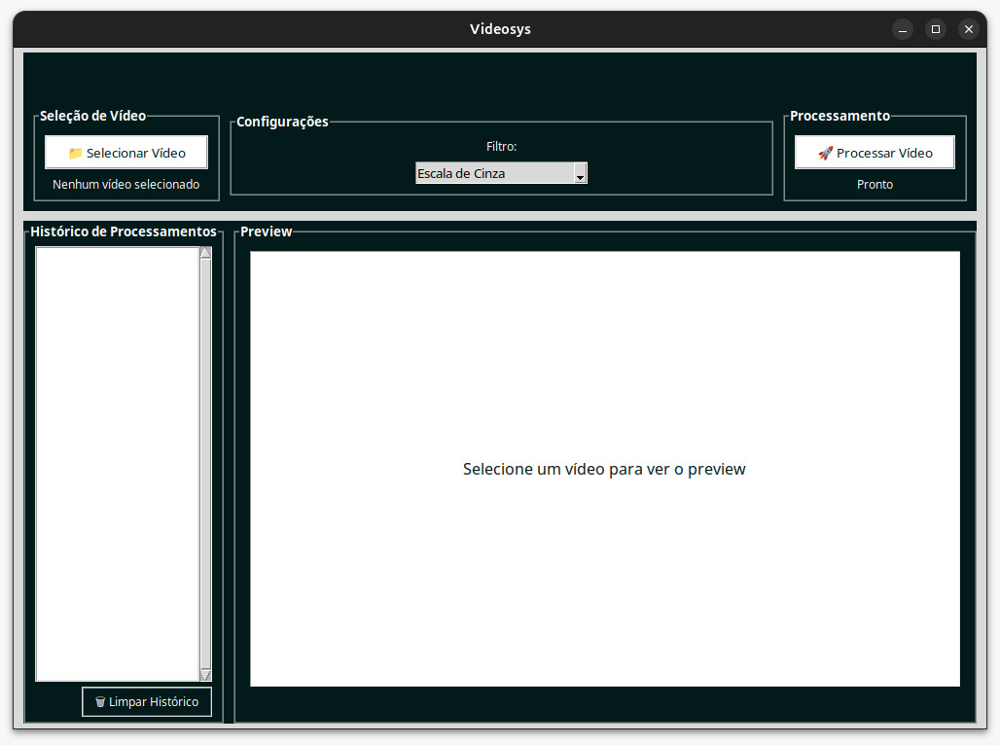
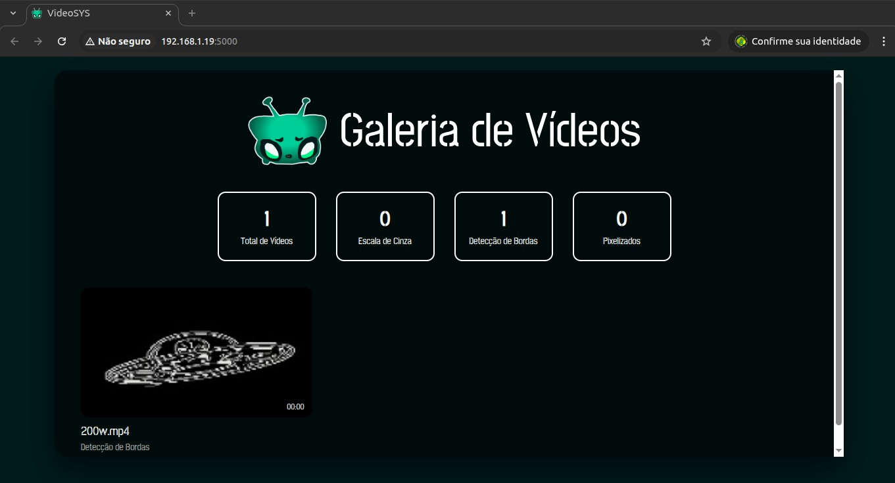

# 📌 Guia de Execução do Projeto: Cliente de Processamento de Vídeos

Este repositório contém o **Cliente de Processamento de Vídeos**, desenvolvido em **Python com Tkinter**, que permite:

- Selecionar vídeos do computador.
- Aplicar filtros (gray, edges, pixel).
- Visualizar prévia das imagens processadas.
- Manter histórico dos processamentos.

---

## 📁 Estrutura do Projeto

```bash
VideoClient
├── src/
│   ├── client/
│   │   └── app.py               # Código do cliente
│   └── ...
│   ├── database/
│   │   └── videos.db            # Banco de dados
│   └── ...
│   ├── media/                   # Vídeos do servidor
│   │   └── ...
│   ├── server/
│   │   └── filters/             # Filtros
│   │       └── ...
│   │   └── storage/             # Gerenciador de caminhos / metadados
│   │       └── ...
│   │   └── api.py               # Código do servidor
│   └── ...
├── requirements.txt             # Dependências Python
├── README.md                    # Documentação do projeto
```

---

## 🚀 Como rodar o Cliente Tkinter (Python)

1. Navegue até a pasta do projeto:

```bash
cd VideoClient
```

2. Crie um ambiente virtual Python (recomendado):

```bash
python -m venv .venv
```

3. Ative o ambiente virtual:

- **Linux/macOS**:

```bash
source .venv/bin/activate
```

- **Windows (PowerShell)**:

```powershell
.venv\Scripts\Activate.ps1
```

4. Instale as dependências listadas em `requirements.txt`:

```bash
pip install -r requirements.txt
```

5. Execute o servidor:

```bash
python src/server/api.py
```

6. Execute o cliente:

```bash
python src/client/app.py
```

---

## ⚙️ Configuração

- O cliente se comunica com o **servidor** através do endereço definido em:

```python
self.server_url = "http://<IP_DO_SERVIDOR>:5000"
```

- A rota `/filters` é utilizada para obter os filtros disponíveis.
- A rota `/upload` é utilizada para enviar vídeos para processamento.
- A rota `/api/videos` pode ser utilizada para preencher o histórico automaticamente.

---

## 🖥️ Telas
## Tela do servidor quando iniciado: 
 
## Tela do cliente para escolha do filtro e upload do video: 
 
## Tela do servidor com video com video: 
 
